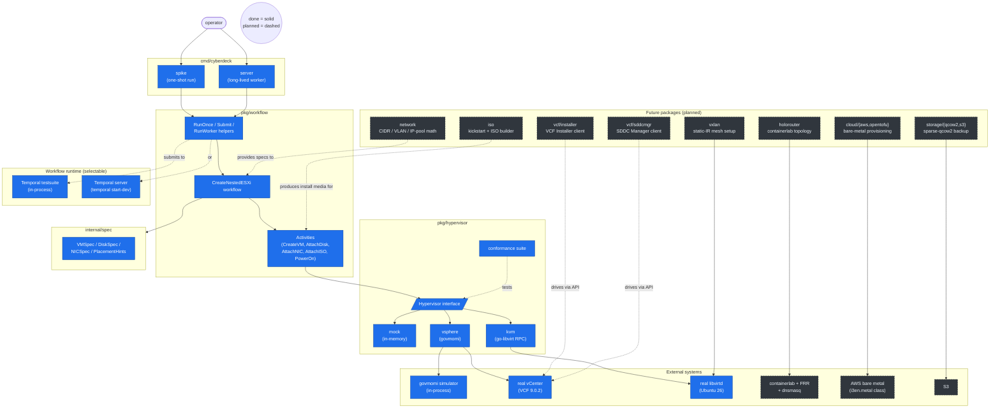

# Architecture

Cyberdeck orchestrates the install, confiugration and maintenance nested VMware Cloud Foundation and Tanzu labs across vSphere and KVM.  It handles networking, storage, snapshot/restore, security, and a web top entry point.

It's obviously inspired by the Broadcom Holodeck project, just focused on more targets than nested ESXi.


## Component overview



**Reading the diagram:**
- Solid blocks (blue/orange) are implemented today.
- Dashed blocks are designed but not yet built.
- The CLI never touches a hypervisor SDK directly. Workflow → Activities → `Hypervisor` interface → backend.

## Why this shape

1. **`Hypervisor` interface from day one.** The legacy PowerShell wires PowerCLI calls directly into business logic across 19 modules; that's exactly what makes the KVM port hard. Cyberdeck inverts it: the workflow knows about `CreateVM(spec)`, not about `New-VM` or libvirt domain XML.
2. **Workflow runtime is swappable.** In tests, the in-process Temporal testsuite runs workflows in milliseconds. In actual use, the same workflow code runs against a real Temporal server with durable history, retries, and visibility.
3. **Spec is hypervisor-agnostic.** `VMSpec` is the union of what nested ESXi needs. Each backend translates it into its native shape (govmomi `VirtualMachineConfigSpec` / libvirt domain XML). Spec changes ripple to every backend through one interface.
4. **Conformance suite is reusable.** Every backend runs the same 5-test contract. Adding a new operation means failing every backend's tests until they all implement it. Catches "implementation drift" early.

## Why Temporal?

Cyberdeck orchestrates work that is **long, multi-step, partially failing, and slow to recover from**. A full VCF deploy is hours of OVA uploads, ESXi installs, vCenter bringups, NSX edge config, network routers from different vendors (Arista, FRR, etc.), S3 object file backups in the multi-TB  range, and SDDC-Manager API polls — any one of which can hang, time out, or come back with a transient error that just needs a retry. The HoloDeck tracked all of this with side-effecty JSON files and `Get-SDDCTaskStatus` polling loops.

Temporal is purpose-built for exactly this shape:

- **Durable execution.** Workflow code is replayed from event history on every worker poll. If a worker crashes mid-deploy, the next one picks up at the exact instruction where the previous one died — no state-file scraping, no "which step were we on" guessing. The workflow function looks like normal Go: `if err := AttachDisk(...); err != nil { return err }`. Temporal makes that durable.
- **Activity-level retries with policy.** Every external call is an activity with its own retry policy (initial interval, max interval, max attempts, non-retryable error classes). Flaky vCenter REST endpoint? Set `MaximumAttempts: 5` on that activity, move on. We saw this in the spike: `PowerOn` failed three times against a missing bridge and the workflow surfaced a clean error chain showing all three attempts.
- **Heartbeats for long-running ops.** Activities that take minutes (OVA upload, ESXi install boot, vSAN cluster formation) heartbeat back to the server. If the heartbeat times out, the activity is rescheduled — no orphaned 90-minute hangs.
- **Signals + queries.** "I fixed the upstream DNS thing, please continue" maps to `client.SignalWorkflow`. "What step is this deploy on right now?" maps to `client.QueryWorkflow`. Both work without redeploying anything.
- **Built-in visibility.** Temporal UI shows full workflow history, every activity's input/output, retry counts, and current state. Replaces the legacy `holodeck-runtime-log_<ts>.log` grep workflow with a real query interface.

### Operational footprint is smaller than you'd think

`temporal server start-dev` ships embedded SQLite — single binary, ~570 MB install via `brew install temporal`, no external database. For customers running cyberdeck on a workstation or a single bastion VM, that's a one-time install with no operational ongoing cost.  Future work could use a more scaled setup. 


## Directory layout

```
cyberdeck/
├── cmd/cyberdeck/        cobra CLI: spike, server
├── internal/spec/        VMSpec types (private to this module)
├── pkg/
│   ├── hypervisor/       interface + mock + vsphere + kvm + conformance
│   └── workflow/         CreateNestedESXi + Activities + worker + run helpers
├── config/               legacy holorouter templates (FRR, dnsmasq, k8s,
│                         VCF installer JSON specs) — reference for porting
├── docs/                 architecture / testing / roadmap (you are here)
├── go.mod
└── README.md
```

## Key design choices captured elsewhere

- **Why Go, why govmomi, why Temporal**: the [README](../README.md) and the project memory.
- **Operational settings for ESXi-on-KVM** (vmxnet3, SATA + rotation_rate=1, host-passthrough): inline comments in `pkg/hypervisor/kvm/kvm.go`.
- **Test layer pattern**: [docs/testing.md](testing.md).
- **What's planned and in what order**: [docs/roadmap.md](roadmap.md).
