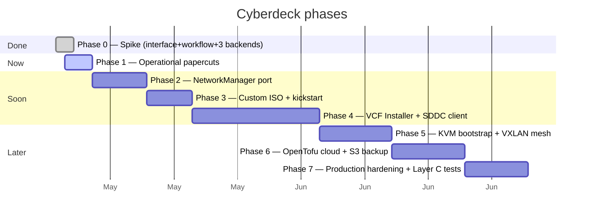
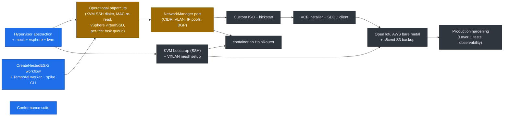

# Roadmap

Phased plan for getting cyberdeck from "spike" to "useable by mortals." Each phase has a concrete deliverable and an estimated size; sizes are intentionally fuzzy — they're for sequencing, not commitments.

## Phase status

## Component readiness

## Phase 1 — operational papercuts (current)

Small but high-leverage fixes that came out of the spike. Each is < half a day on its own.

| # | Item | Why |
|---|---|---|
| 1.1 | **`AttachNIC` returns real MAC on KVM** (re-read domain XML, parse `<mac>` element) | Production-blocker for kickstart-MAC-keyed installs — every nested ESXi host's IP comes from `case $MAC_ADDR in` matching |
| 1.2 | **Per-test task queue suffix** (`cyberdeck-spike-<test-uuid>`) | Eliminates orphan-worker hijack class of bug we hit in this spike |
| 1.3 | **Native `dialers.NewSSH` for KVM** | Replaces `ssh -L` socket-forward workaround so `cyberdeck spike --backend kvm --kvm-host stu@host` Just Works |
| 1.4 | **vSphere `virtualSSD=1` extraConfig** | Mirror `rotation_rate=1` semantics from KVM; legacy `Set-HoloDeckESXiVM` set this. Required for vSAN ESA |
| 1.5 | **`workflow.GetVersion` calls** | Insert now while history is small; cheap to add, expensive to retrofit |
| 1.6 | **Build-not-run for `cyberdeck server` in tests** | Document the orphan trap; consider a small Makefile target |
| 1.7 | **CPU topology field on VMSpec** (`{Sockets, Cores, Threads}`) | virt-install's `--vcpus 40,sockets=1,cores=40` shape; production VCF needs single-socket-many-cores for licensing/NUMA |
| 1.8 | **PlacementHints.StoragePool wiring on KVM** | Currently always `default`; production setups override |

Goal: knock out 1.1, 1.2, 1.3 first (operational pain) — rest can land opportunistically.

## Phase 2 — NetworkManager port

Port the legacy Holodeck `Modules/networkmanager.psm1` (1812 lines of CIDR / VLAN / IP-pool / BGP math) to Go. Pure functions, golden-file tests against the legacy YAML output.

Deliverables:
- `pkg/network/cidr.go` — split a master /20 into per-purpose subnets (mgmt, vmotion, vsan, overlay, edge, etc.)
- `pkg/network/pools.go` — IP allocation per VCF role (NSX TEP, edge, manager, ESXi mgmt, …)
- `pkg/network/bgp.go` — BGP AS, peer addresses, route advertisement specs
- Golden-file tests reading legacy `network_manager_config_site_a.yaml` and asserting field-by-field parity
- Integration with the workflow input (Spec is now generated from a NetworkManager run, not hand-rolled)

## Phase 3 — Custom ISO + kickstart generator

Port `Modules/CustomISO.psm1`. The kickstart is already MAC-keyed and hypervisor-agnostic — that's the seam KVM support flows through.

Deliverables:
- `pkg/iso/kickstart.go` — generate `CYBERDECK.cfg` from a list of (MAC, IP, hostname) tuples + network manager outputs
- `pkg/iso/builder.go` — extract base ESXi ISO, inject CYBERDECK.cfg, repack via `mkisofs`/`genisoimage`. Maybe replace with `github.com/diskfs/go-diskfs` (pure-Go El Torito) — ESXi bootloader is picky, validate with a golden boot test before committing
- Workflow step: build ISO → upload to backend (datastore for vSphere, libvirt storage pool for KVM) → reference in `VMSpec.ISOPath`

## Phase 4 — VCF Installer + SDDC Manager clients

The biggest chunk by line count. Port the HTTP API clients for VCF deployment.

Deliverables:
- `pkg/vcf/installer/` — VCF Installer 9.0+ client: depot config, OVA upload, deployment spec submission, status polling
- `pkg/vcf/cloudbuilder/` — Cloud Builder 5.2 client (legacy support)
- `pkg/vcf/sddcmgr/` — SDDC Manager: bearer token auth, host commissioning, domain creation, NSX edge cluster, workload domain
- `pkg/vcf/automation/` — VCF Automation (VCFA) config
- All as Temporal activities: each long-running poll has heartbeats; failures retry with proper backoff

Reference: legacy `Modules/VcfInstaller.psm1`, `Modules/SddcMgmtDeployment.psm1`, `Modules/SddcWkldDeployment.psm1`, `Modules/NsxEdgeDeployment.psm1`, `Modules/VcfAutomationConfig.psm1` — and the JSON specs in `config/templates/vcfManifestNew90{0,1}.json`.

## Phase 5 — KVM bootstrap + VXLAN mesh

The other half of the "ESXi-on-KVM" story: get the KVM host into a state where cyberdeck can talk to it.

Deliverables:
- `pkg/holorouter/` — generate containerlab YAML topologies for FRR + dnsmasq (replace the bash-script HoloRouter)
- `pkg/vxlan/` — set up static-IR VXLAN mesh between KVM hosts. Stu has the FDB plumbing script — wrap it in Go + run via SSH
- `pkg/kvmboot/` — SSH into a fresh Ubuntu host, verify nested-virt is on, install missing packages (libvirt, qemu, ovmf, containerlab), set up bridges, enable libvirtd

Constraint to surface in precheck: AWS jumbo frames work within an AZ but are clamped to 1500 across AZs. Either pin the lab to a single AZ or accept inner ESXi MTU 1450.

## Phase 6 — OpenTofu cloud + sparse-qcow2 + S3 backup

Cloud substrate via OpenTofu, storage via tar + s5cmd. OpenTofu owns the AWS or GCP substrate, cyberdeck owns inside the host.

Deliverables:
- `terraform/` — OpenTofu modules for VPC, IAM, S3, EC2 metal (i3en.metal / m7i.metal-24xl / c7i.metal-24xl), placement group, security groups
- `pkg/storage/qcow2/` — backup: `tar cvSf` + `s5cmd cp`. Restore: `s5cmd cp` + untar
- v2 (later): extent-aware chunker via `qemu-img map --output=json`

Constraint: NVMe must hold tarball + untarred sparse files simultaneously during restore. Keep individual qcow2 ≤ 1 TB sparse; tetris multiple smaller disks.

## Phase 7 — production hardening

- Layer C end-to-end tests: real z1d.metal, full deploy, teardown, weekly + pre-tag
- Observability: Temporal worker metrics, govmomi/libvirt latency histograms
- Documentation: full operator runbook

---

## Live TODO list (cross-phase)

Maintained as an outline so it's easy to scan. Owners and dates omitted — this is a single-author project right now.

### Operational papercuts (Phase 1)
- [ ] AttachNIC returns real MAC on KVM (re-read domain XML)
- [ ] Per-test task queue suffix (eliminate orphan-worker hijack)
- [ ] Native `dialers.NewSSH` for KVM
- [ ] vSphere `virtualSSD=1` extraConfig (parity with KVM rotation_rate=1)
- [ ] CPUTopology field on VMSpec
- [ ] PlacementHints.StoragePool wiring on KVM
- [ ] `workflow.GetVersion` calls (forward-compat)
- [ ] Document `go build` over `go run` for long-lived workers (orphan trap)
- [ ] vSphere `SetBootOrder` interface method (post-install hd-first)

### Networking (Phase 2)
- [ ] Port NetworkManager CIDR splitter
- [ ] Port IP pool allocator
- [ ] Port BGP / EVPN config generator
- [ ] Golden-file tests vs legacy YAML output

### ISO + kickstart (Phase 3)
- [ ] Port CYBERDECK.cfg generator
- [ ] ISO repacker (mkisofs first, evaluate go-diskfs later)
- [ ] Workflow step: build → upload → reference in VMSpec
- [ ] Boot test: nested ESXi installs end-to-end on both backends

### VCF deploy (Phase 4)
- [ ] VCF Installer HTTP client
- [ ] Cloud Builder (5.2) HTTP client
- [ ] SDDC Manager bearer-token auth + workflow API
- [ ] Workload domain deploy
- [ ] NSX edge cluster
- [ ] VCF Automation config

### KVM bootstrap + VXLAN (Phase 5)
- [ ] Replace HoloRouter bash with containerlab topology
- [ ] VXLAN static-IR mesh setup (port Stu's FDB script)
- [ ] SSH-based KVM host bootstrap (precheck + install)
- [ ] AZ jumbo-frame precheck

### Cloud (Phase 6)
- [ ] OpenTofu modules for AWS bare metal + S3 + IAM
- [ ] tar + s5cmd backup/restore
- [ ] Backup integrity test (round-trip a 100 GiB sparse qcow2)

### Production hardening (Phase 7)
- [ ] Layer C nightly + pre-release tests
- [ ] Temporal worker observability
- [ ] Full operator runbook
- [ ] Legacy state importer

### Nice-to-have / opportunistic
- [ ] Embedded Temporal dev server (so customers don't install separately) — only if worth the dependency weight
- [ ] Web UI on top of the Temporal UI for cyberdeck-specific operations
- [ ] Automatic ESXi version detection from ISO (vs hardcoded vmkernel7guest)
- [ ] Multi-region backup (S3 cross-region replication)
- [ ] NBD/fuse lazy hydration of qcow2 from S3 (Stu has tested; rejected for v1 — reconsider later if access patterns change)

---

## What's deliberately out of scope

- **Supporting hypervisors beyond vSphere and KVM in v1.** Hyper-V and Xen are abstractable through the same interface but no demand yet.
- **A Web UI for cyberdeck.** Temporal UI gives us workflow visibility for free; the cyberdeck CLI is the operator surface, though we'll expose a webtop.
- **An embedded Temporal server.** The dev-server install is one `brew install temporal` and the operational story is identical. Embedding it pulls in a massive dependency tree (Postgres adapters, Cassandra adapters, gRPC services) we don't need.
