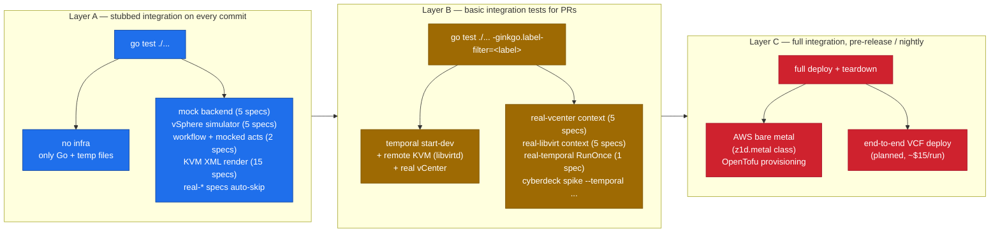

# Testing

Cyberdeck uses **outside-in test driven development at the functional and integration boundary**, with [ginkgo v2 + gomega](https://onsi.github.io/ginkgo/) as the test framework — `Describe / Context / It` reads as the contract, the situation, and the expected behavior. We're using three layers, each with its own infrastructure cost:



## Layer A — functional, no infra

Run on every commit. Should be **green by default**, even on a fresh dev box.

```sh
go test ./...                    # quiet
go test ./... -v -ginkgo.v       # full spec tree
```

What it exercises:
- **Mock backend** (5 specs) — full Hypervisor contract against the in-memory backend.
- **vSphere `Context("against the govmomi simulator")`** (5 specs) — `simulator.VPX()` runs in-process and exposes the real SOAP API. No vCenter required.
- **Workflow specs** (2 specs) — `testsuite.WorkflowTestSuite` runs `CreateNestedESXi` deterministically with both real activities (against the mock hypervisor) and mocked activities.
- **KVM render specs** (15 specs) — Its for each operationally-load-bearing knob (q35 + UEFI, host-passthrough + vmx, SATA + rotation_rate=1, vmxnet3, cache=none/io=native, VNC + QXL) plus a `DescribeTable` for `parseNetworkRef`.
- **real-* contexts skip** in their `BeforeEach` with a clear reason when their env vars aren't set.

Expected runtime: 5–8 seconds total.

### How to read the output

Plain `go test ./...` prints one line per package. Add `-v -ginkgo.v` to see the spec tree. Add `-ginkgo.vv` to see `By(...)` step output and skip reasons.

To focus on one Describe/Context/It:

```sh
go test ./pkg/hypervisor/kvm/... -v \
  -ginkgo.focus="renderDomainXML for ESXi-on-KVM"
```

## Layer B — local integration

Run on every PR (or before pushing). Requires running infrastructure but no cloud spend.

Real-infra specs are gated by both **labels** and **env vars**:

| Label | Env vars unlocking it | What runs |
|---|---|---|
| `real-temporal` | `TEMPORAL_ADDR` | RunOnce against a real Temporal server |
| `real-vcenter`  | `VCENTER_HOST/USER/PASS` (+ optional placement overrides) | Hypervisor contract against a live vCenter |
| `real-libvirt`  | `LIBVIRT_URI`, `LIBVIRT_TEST_ISO` (+ optional `LIBVIRT_SOCKET`) | Hypervisor contract against a live libvirtd |

The `real-infra` umbrella label matches all three.

### Real Temporal worker

```sh
brew install temporal                          # one-time
temporal server start-dev &                    # gRPC :7233, Web UI http://localhost:8233
TEMPORAL_ADDR=localhost:7233 \
  go test ./pkg/workflow/... -ginkgo.label-filter=real-temporal
```

The Web UI shows event history per workflow ID — the spec generates `cd-runonce-test-<timestamp>`. Workflows persist in-memory until the dev server restarts; pass `--db-filename ~/.cyberdeck/temporal.db` if you want persistence across restarts.

### Real KVM

Set up an SSH socket forward to a remote libvirtd (until we add a native SSH dialer):

```sh
ssh -fN -o StreamLocalBindUnlink=yes \
    -L /tmp/cyberdeck-libvirt.sock:/var/run/libvirt/libvirt-sock \
    -i ~/.ssh/id_ubuntu stu@172.30.0.20

# A throwaway file libvirt can attach as a CDROM (idempotent).
ssh -i ~/.ssh/id_ubuntu stu@172.30.0.20 \
  'virsh vol-list default | grep -q cyberdeck-test.iso || \
   virsh vol-create-as default cyberdeck-test.iso 64K --format raw'

LIBVIRT_URI=qemu:///system \
LIBVIRT_SOCKET=/tmp/cyberdeck-libvirt.sock \
LIBVIRT_TEST_ISO=/mnt/esxi9/cyberdeck-test.iso \
  go test ./pkg/hypervisor/kvm/... -ginkgo.label-filter=real-libvirt
```

### Real vCenter

```sh
VCENTER_HOST=vc01.vcf.lab \
VCENTER_USER='administrator@vsphere.local' \
VCENTER_PASS='VMware1!VMware1!' \
VCENTER_DATASTORE=local-vmfs-datastore-1 \
VCENTER_NETWORK=DVPG_FOR_VM_MANAGEMENT \
  go test ./pkg/hypervisor/vsphere/... -ginkgo.label-filter=real-vcenter
```

Each spec creates a `cd-<6-char-hash>-<suffix>` VM (the hash is derived from the spec's full text, so cleanup is reproducible across runs), exercises the lifecycle, and tears it down in `AfterEach`. Re-running is safe; partial failures still tear down.

### Run all real-infra at once

```sh
TEMPORAL_ADDR=localhost:7233 \
VCENTER_HOST=… VCENTER_USER=… VCENTER_PASS=… \
LIBVIRT_URI=qemu:///system LIBVIRT_SOCKET=… LIBVIRT_TEST_ISO=… \
  go test ./... -ginkgo.label-filter=real-infra
```

### End-to-end spike CLI

The same workflow can be driven from the CLI against any combination of runtime × backend:

```sh
# 8 cells of the test matrix
cyberdeck spike --backend mock
cyberdeck spike --backend mock     --temporal localhost:7233
cyberdeck spike --backend vsphere
cyberdeck spike --backend vsphere  --temporal localhost:7233
VCENTER_HOST=… cyberdeck spike --backend vsphere
VCENTER_HOST=… cyberdeck spike --backend vsphere  --temporal localhost:7233
LIBVIRT_URI=… cyberdeck spike --backend kvm
LIBVIRT_URI=… cyberdeck spike --backend kvm       --temporal localhost:7233
```

All 8 combinations are validated in the project memory.

## Layer C — real cloud (planned)

Nightly + pre-release. Provision a real `z1d.metal` on AWS via OpenTofu, run a full VCF deploy with cyberdeck, tear down. Estimated ~$15–20/run, capped to weekly + per-tag dispatch with a 24h budget alarm and a teardown lambda for failed runs.

Not in the spike. Will land with the AWS provisioning work in Phase 5 of the [roadmap](roadmap.md).

## Patterns to keep using

### One conformance contract, many backends

`pkg/hypervisor/conformance/conformance.go` exposes `HypervisorContract(factory)` — a function that registers the full Hypervisor contract as Ginkgo specs in the *calling* container. Each backend's test file invokes it from inside a `Describe/Context`:

```go
var _ = Describe("Mock backend", func() {
    conformance.HypervisorContract(func() (hypervisor.Hypervisor, conformance.Defaults, func()) {
        h := mock.New()
        return h, conformance.Defaults{ISOPath: "[mock]/CYBERDECK.iso"}, func() { _ = h.Close() }
    })
})
```

When you add a new operation to the `Hypervisor` interface, add the It to `conformance.go`. Every backend's spec suite then fails until it implements the method. That's the point.

### `AfterEach` for resource teardown — track immediately after CreateVM

Real backends (KVM, vCenter) have persistent state. An `Expect(err).ToNot(HaveOccurred())` failure mid-spec stops the function before any trailing `Destroy` call. The contract's pattern is to register the VM for teardown via a `track()` closure **immediately after** a successful CreateVM; `AfterEach` then iterates `toDestroy` LIFO and runs the backend's cleanup func last (so VMs are destroyed before the libvirt/govmomi connection closes).

### Skip-with-reason in `BeforeEach` for missing infra

Real-infra factories call `Skip("…explain which env var would enable this…")` at the top of the factory closure — `BeforeEach` invokes the factory, so Skip propagates correctly to the spec. Never `Fail()` on missing infra.

### Labels for grouping, not for skipping

Labels (`real-infra`, `real-vcenter`, `real-libvirt`, `real-temporal`) are how you *select* which real-infra suites to run via `-ginkgo.label-filter`. Skip behavior is still env-var-driven inside the factory — labels just spare you typing `-ginkgo.focus="…"` regexes. A spec with the right label but missing env vars still skips.

### `DescribeTable` for table-driven cases

Replace `for _, tc := range testCases { t.Run(tc.name, ...) }` with:

```go
DescribeTable("translates X into Y",
    func(in, want string) { Expect(f(in)).To(Equal(want)) },
    Entry("explicit form", "bridge:br-trunk", "br-trunk"),
    Entry("bare name",     "VM Network",      "VM Network"),
)
```

Each `Entry` becomes its own It in the spec tree — better failure isolation than a loop, and the entry description shows up as the spec name.

### One ginkgo suite per directory

`go test` builds one binary per directory and runs every `TestX` in it. Each `RunSpecs` call consumes the global `Describe`/`It` registry, so two `TestX` functions both calling `RunSpecs` would clash. If you need to test unexported helpers, keep them in the same package as the production code (e.g. `pkg/hypervisor/kvm` puts both `package kvm` internal tests and what would naturally be `package kvm_test` in the same `package kvm`).

### Build, don't `go run`, for long-lived workers

`go run ./cmd/cyberdeck server …` doesn't propagate signals — `kill <PID>` only kills the `go run` parent and orphans the compiled binary, leaving a stale worker polling the task queue. For local worker testing:

```sh
go build -o /tmp/cyberdeck ./cmd/cyberdeck
/tmp/cyberdeck server --backend vsphere --temporal localhost:7233
```

## Cleanup runbook

Things to check / clean between sessions:

```sh
# Local
pgrep -f "temporal server start-dev"     # leftover dev server
pgrep -f "cyberdeck server"              # orphan workers
ls /tmp/cyberdeck-*                       # leftover sockets / sqlite db
rm -f /tmp/cyberdeck-libvirt.sock /tmp/cyberdeck-temporal.db

# Remote vCenter — destroy any cd-* VMs
# (use a small govmomi helper, see project memory for the script)

# Remote KVM — destroy any cd-* domains + volumes
ssh -i ~/.ssh/id_ubuntu stu@172.30.0.20 '
  for d in $(virsh list --all --name | grep "^cd-"); do
    virsh destroy "$d" 2>/dev/null
    virsh undefine --nvram --managed-save --snapshots-metadata --checkpoints-metadata "$d"
  done
  for v in $(virsh vol-list default | awk "/^ cd-/ {print \$1}"); do
    virsh vol-delete --pool default "$v"
  done'
```
