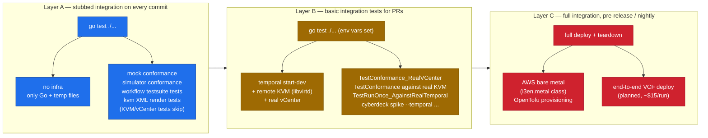

# Testing

Cyberdeck uses **outside-in test driven development at the functional and integration boundary**. We're using three layers, each with its own infrastructure cost:



## Layer A — functional, no infra

Run on every commit. Should be **green by default**, even on a fresh dev box.

```sh
go test ./...
```

What it exercises:
- **Mock hypervisor conformance** (5 tests) — full lifecycle against in-memory backend.
- **vSphere conformance against govmomi simulator** (5 tests) — `simulator.VPX()` runs in-process, exposes the real SOAP API. No vCenter required.
- **Workflow tests** — `testsuite.WorkflowTestSuite` runs `CreateNestedESXi` deterministically with mocked time and either real-or-mocked activities.
- **KVM XML render tests** — golden-string assertions on the libvirt domain XML cyberdeck would emit (vmxnet3, SATA + rotation_rate=1, cache=none/io=native, host-passthrough, VNC + QXL).
- KVM/real-vCenter/real-Temporal integration tests **skip** with a clear reason when their env vars are unset.

Expected runtime: 5–8 seconds total.

## Layer B — local integration

Run on every PR (or before pushing). Requires running infrastructure but no cloud spend.

### Real Temporal worker

```sh
brew install temporal                          # one-time
temporal server start-dev --headless &         # localhost:7233
TEMPORAL_ADDR=localhost:7233 \
  go test -run RunOnce ./pkg/workflow/...
```

### Real KVM

Set up an SSH socket forward to a remote libvirtd (until we add a native SSH dialer):

```sh
ssh -fN -o StreamLocalBindUnlink=yes \
    -L /tmp/cyberdeck-libvirt.sock:/var/run/libvirt/libvirt-sock \
    -i ~/.ssh/id_ubuntu stu@172.30.0.20

# A throwaway file libvirt can attach as a CDROM (idempotent).
ssh -i ~/.ssh/id_ubuntu stu@172.30.0.20 \
  'virsh vol-list default | grep -q cyberdeck-test.iso || \
   virsh vol-create-as default cyberdeck-test.iso 64K --format raw'

LIBVIRT_URI=qemu:///system \
LIBVIRT_SOCKET=/tmp/cyberdeck-libvirt.sock \
LIBVIRT_TEST_ISO=/mnt/esxi9/cyberdeck-test.iso \
  go test -run TestConformance ./pkg/hypervisor/kvm/...
```

### Real vCenter

```sh
VCENTER_HOST=vc01.vcf.lab \
VCENTER_USER='administrator@vsphere.local' \
VCENTER_PASS='VMware1!VMware1!' \
VCENTER_DATASTORE=local-vmfs-datastore-1 \
VCENTER_NETWORK=DVPG_FOR_VM_MANAGEMENT \
  go test -run TestConformance_RealVCenter ./pkg/hypervisor/vsphere/...
```

Each subtest creates a `cd-<6-char-hash>-<suffix>` VM, exercises the lifecycle, and tears it down via `t.Cleanup`. Re-running is safe; partial failures still teardown.

### End-to-end spike CLI

The same workflow can be driven from the CLI against any combination of runtime × backend:

```sh
# 8 cells of the test matrix
cyberdeck spike --backend mock
cyberdeck spike --backend mock     --temporal localhost:7233
cyberdeck spike --backend vsphere
cyberdeck spike --backend vsphere  --temporal localhost:7233
VCENTER_HOST=… cyberdeck spike --backend vsphere
VCENTER_HOST=… cyberdeck spike --backend vsphere  --temporal localhost:7233
LIBVIRT_URI=… cyberdeck spike --backend kvm
LIBVIRT_URI=… cyberdeck spike --backend kvm       --temporal localhost:7233
```

All 8 combinations are validated in the project memory.

## Layer C — real cloud (planned)

Nightly + pre-release. Provision a real `z1d.metal` on AWS via OpenTofu, run a full VCF deploy with cyberdeck, tear down. Estimated ~$15–20/run, capped to weekly + per-tag dispatch with a 24h budget alarm and a teardown lambda for failed runs.

Not in the spike. Will land with the AWS provisioning work in Phase 5 of the [roadmap](roadmap.md).

## Patterns to keep using

### Conformance suite over per-backend tests

When you add a new operation to the `Hypervisor` interface, add the assertion to `pkg/hypervisor/conformance/conformance.go`. Every backend's `_test.go` then fails until it implements the new method. That's the point.

### `t.Cleanup` for resource teardown

Real backends (KVM, vCenter) have persistent state. A `require.NoError` failure mid-test stops the function before any trailing `Destroy` call. Register cleanup with `t.Cleanup` immediately after `CreateVM` succeeds — LIFO ordering guarantees teardown runs before the connection is closed.

### Skip-with-reason for missing infra

Tests that require external services should skip with a clear `t.Skip` message including the env var that would enable them. Never `t.Fatal` on missing infra.

### Build, don't `go run`, for long-lived workers

`go run ./cmd/cyberdeck server …` doesn't propagate signals — `kill <PID>` only kills the `go run` parent and orphans the compiled binary, leaving a stale worker polling the task queue. For local worker testing:

```sh
go build -o /tmp/cyberdeck ./cmd/cyberdeck
/tmp/cyberdeck server --backend vsphere --temporal localhost:7233
```

## Cleanup runbook

Things to check / clean between sessions:

```sh
# Local
pgrep -f "temporal server start-dev"     # leftover dev server
pgrep -f "cyberdeck server"              # orphan workers
ls /tmp/cyberdeck-*                       # leftover sockets / sqlite db
rm -f /tmp/cyberdeck-libvirt.sock /tmp/cyberdeck-temporal.db

# Remote vCenter — destroy any cd-* VMs
# (use a small govmomi helper, see project memory for the script)

# Remote KVM — destroy any cd-* domains + volumes
ssh -i ~/.ssh/id_ubuntu stu@172.30.0.20 '
  for d in $(virsh list --all --name | grep "^cd-"); do
    virsh destroy "$d" 2>/dev/null
    virsh undefine --nvram --managed-save --snapshots-metadata --checkpoints-metadata "$d"
  done
  for v in $(virsh vol-list default | awk "/^ cd-/ {print \$1}"); do
    virsh vol-delete --pool default "$v"
  done'
```
